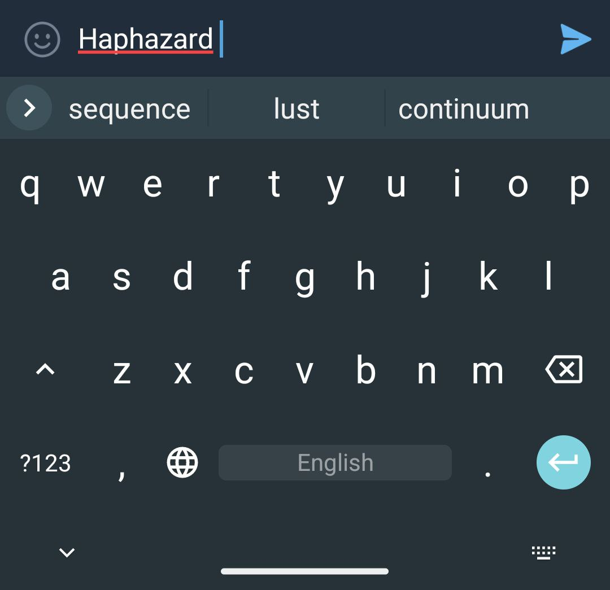

# Nabokov's dictionary

Dictionary files for aosp-like keyboards created using works written by Vladimir Nabokov.

The English dictionary is based on:
* Lolita
* Pnin
* Pale Fire
* Ada or Ardor: A Family Chronicle

The Russian dictionary is based on:
* Машенька
* Король, дама, валет
* Защита Лужина
* Подвиг
* Камера обскура
* Отчаяние
* Приглашение на казнь
* Дар


|  |  |
| ---------------------  | --------------------- |

## How to use

#### Easy way

1. Install "./dist/HeliBoard*.apk" on your phone
1. Select English (US) and Russian layouts

#### Not working(yet?) way

1. Install "HeliBoard*.apk" from [this repo](https://github.com/Helium314/HeliBoard)
1. Select English (US) and Russian layouts
1. Add dictionary to Russian and English layouts

However, this approach didn't work when I tried. Probably because of a poor quality of the dictionaries or unimplemented feature in the app.

#### If you are brave

1. Clone any aosp-based keyboard repo. I'd recommend [HeliBoard](https://github.com/Helium314/HeliBoard), because it is easy to build on modern PC(currently)
1. Replace "main_en.dict" and "main_ru.dict" with files from the "./dist". Delete "main_en-GB.dict" and "main_en-US.dict"
1. Build and sign the app

#### Chad way


1. Clone the repo recursively
2. Build the util
```bash
make
```
3. Build Russian and English dictionary files
```bash
./dictbuilder priglashenie-na-kazn.txt The-gift.txt > ./dist/nabokov_ru_wordlist.combined
./dictbuilder --locale en ada-or-ardor.txt pale-fire.txt > ./dist/nabokov_en_wordlist.combined
```
4. Clone [this repo](https://github.com/remi0s/aosp-dictionary-tools)
5. Build dictionary binaries
```bash
java -jar dicttool_aosp.jar makedict -s nabokov_en_wordlist.combined -d main_en.dict
java -jar dicttool_aosp.jar makedict -s nabokov_ru_wordlist.combined -d main_ru.dict
```
6. Repeate steps from "**If you are brave**" section
